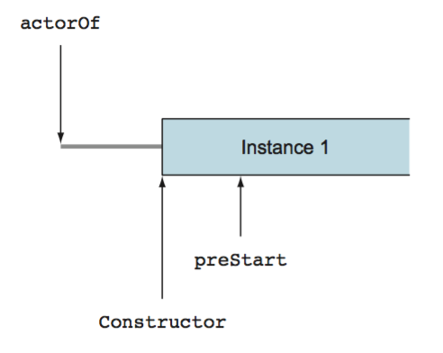
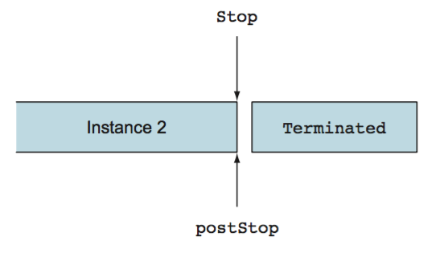
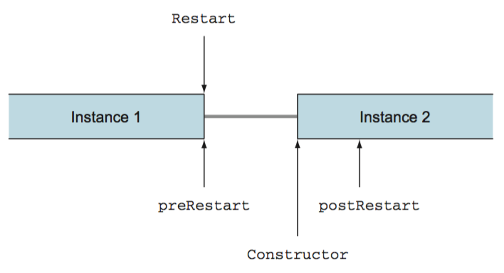
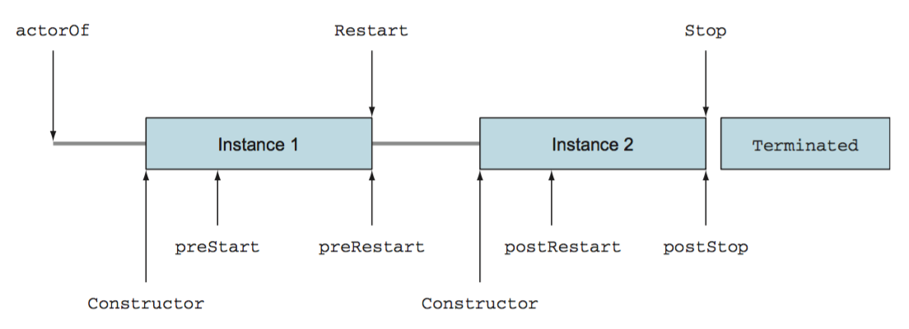

## Actor 生命周期
一个 actor 是一个容器，里面装了 `State`、`Behavior`、`Mailbox`、`Child Actors` 和 `Supervisor Strategy`，所有的这些封装在一个 `Actor Reference` 里。Actor 有显示的生命周期，当没有对象引用某个 actor时，它并不会自动销毁（比如被 GC）。在创建一个 actor 后，我们需要对它的生命周期负责，要确保它最后会被终止（terminated）。

Actor 在被创建后会自动进入 `Started` 状态，并且它会一直保持这个状态直接它被终止而进入 `Terminated` 状态。一个 actor 被终止后它不能再处理消息，最终它会被 GC 掉。当一个 actor 处于 `Started` 状态时，它能够被重启（restart）来重置它的内部状态。通过重启，会创建一个全新的 actor instance 来替代旧的 actor instance。在 actor 的生命周期里，它能根据需要被重启任意次数。

在 actor 的生命周期里，有三种类型的 event:
- _start_ event: actor 被创建（created）和启动（started）
- _restart_ event: actor 被重启（restarted）
- _stop_ event: actor 被停止（stopped）

在 `Actor` trait 里提供了好几个 hook，这些 hook 在 actor 生命周期里的对应 event 发生时会被调用：
```scala
  /**
   * User overridable callback.
   * <p/>
   * Is called when an Actor is started.
   * Actors are automatically started asynchronously when created.
   * Empty default implementation.
   */
  @throws(classOf[Exception]) // when changing this you MUST also change UntypedActorDocTest
  def preStart(): Unit = ()

  /**
   * User overridable callback.
   * <p/>
   * Is called asynchronously after 'actor.stop()' is invoked.
   * Empty default implementation.
   */
  @throws(classOf[Exception]) // when changing this you MUST also change UntypedActorDocTest
  def postStop(): Unit = ()

  /**
   * User overridable callback: '''By default it disposes of all children and then calls `postStop()`.'''
   * @param reason the Throwable that caused the restart to happen
   * @param message optionally the current message the actor processed when failing, if applicable
   * <p/>
   * Is called on a crashed Actor right BEFORE it is restarted to allow clean
   * up of resources before Actor is terminated.
   */
  @throws(classOf[Exception]) // when changing this you MUST also change UntypedActorDocTest
  def preRestart(reason: Throwable, message: Option[Any]): Unit = {
    context.children foreach { child ⇒
      context.unwatch(child)
      context.stop(child)
    }
    postStop()
  }

  /**
   * User overridable callback: By default it calls `preStart()`.
   * @param reason the Throwable that caused the restart to happen
   * <p/>
   * Is called right AFTER restart on the newly created Actor to allow reinitialization after an Actor crash.
   */
  @throws(classOf[Exception]) // when changing this you MUST also change UntypedActorDocTest
  def postRestart(reason: Throwable): Unit = {
    preStart()
  }
```
我们来看看这些 event。
### Start
一个 actor 通过父 actor 的 `ActorContext` 的 `actorOf` 方法被创建（created）和启动（started），顶层的 actor 由 `ActorSystem` 使用 `actorOf` 方法创建。父 actor 使用它的 `ActorContext` 的 `actorOf` 方法来创建子 actor。在 actor 被创建后，它会由 Akka 启动（started）。在 actor 启动之前，`preStart` 这个 hook 会被调用。要使用这个 hook，需要 override `preStart` 这个方法：
```scala
override def preStart() {
  println("preStart")
}
```
通常有两种方法来给一个 Actor 设置初始状态：
- 使用 actor 的构造器
- 使用  `preStart` hook

构造器和 `preStart` 的调用顺序可以从这张图看出（图片来自《Akka in Action》）：

### Stop
_stop_ 这个 event 标志着一个 actor 的终结，在 actor 的生命周期里它只会出现一次。一个 actor 可以通过 `ActorSystem` 或者 `ActorContext` 的 `stop` 方法来终止，也可以通过给 actor 发送一个 `PoisonPill` 消息（这会间接的调用 `stop`方法）。在 actor 进入 `Terminated` 状态之前，`postStop` 这个 hook 会被调用。前面提到过，当一个 actor 进入 `Terminated` 状态之后，它不再处理任何新消息。`postStop` 和 `preStart` 这两个 hook 是对应存在的（图片来自《Akka in Action》）：

通常，会在这个 hook 里实现和 `preStart` 相反的工作：比如释放在`preStart` 方法里创建的资源，或者将当前 actor instance 的最后状态存储到这个 actor instance 外面以便下一个 actor instance 来使用当前 instance 的最后状态。
```scala
override def postStop() {
  println("postStop")
}
```
在一个 actor 停止（stopped）后，它的 `ActorRef` 会指向 actor system 的 `deadLettersActorRef`，这是一个特殊的 `ActorRef`，它会接收所有发向已经死亡（dead）的 actor 的消息。
### Restart
在一个 actor 的生命周期里，它的 监督者（supervisor）可能会决定让它重启多次（如果使用了 Restart 的策略，那么每当抛出异常就会重启）。在 actor 的重启过程中，actor instance 会被替代（图片来自《Akka in Action》）：

当一次重启发生时，发生重启的 actor instance 的 `preRestart` 方法会被调用，这个 actor instance 可以在被新的 instance 替代前在这个方法里存储当前的状态：
```scala
override def preRestart(reason: Throwable, message: Option[Any]): Unit = {
  println("preRestart")
  super.preRestart(reason, message)
}
```
方法里的 `reason` 是这个 actor instance 抛出的异常，如果是在 `receive` 方法里出现的错误，`message` 是这个 actor 正在处理的那个消息。

在 override 这个 hook 需要非常小心：`PreRestart` 的默认实现会先停止这个 actor instance 的所有子 actor（通过调用 `stop`方法），然后调用 `postStop` 来停止当前 instance。如果在 override 的时候忘了调用 `super.preRestart(reason, message)` ，默认的实现不会被调用到。我们知道 actor instance 通过 `Props` 对象创建，而 `Props` 对象最终调用的是 actor 的构造器，在调用构造器的过程中，这个 actor 的所有子 actor 都会被重新创建，如果我们没有在 `preRestart` 里让所有子 actor 终止，那这个 actor 的子 actor 数量会随着重启次数的增加不断增加。

前面说到可以通过 `stop` 方法来停止一个 actor，需要注意的是，restart 过程中停止这个 crashed actor 的方法和 `stop` 方法不一样。crashed actor 在重启过程中并不会有 `Terminated` 消息送到它的监控者（monitor）。在重启过程中新创建的 actor instance 会连接到之前的 ActorRef 上。而 stopped actor 会从之前的 ActorRef 上断开连接并将它自己连接到 `deadLettersActorRef` 上。

_stopped actor instance_ 和 _crashed actor instance_ 共有的，是在切断和 actor system 的联系后，`postStop` 方法会被调用。

在一个新的 actor instance 被创建起来后，会调用新 actor instance 中的 `postRestart` 方法：
```scala
override def postRestart(reason: Throwable): Unit = {
  println("postRestart")
  super.postRestart(reason)
}
```
`reason` 参数就是之前 `preRestart` 方法里的那个，`super.postRestart(reason)` 调用默认会触发 `preStart` 方法，如果在重启过程中可以不调用 `preStart` 方法那么可以忽略 `super.postRestart(reason)`。但在通常情况下，我们都会在 `preStart` 和 `postStop` 这两个方法里添加一些逻辑。
### 生命周期
当我们把前面提到的一些 event 放到一起时，就得到了一个 actor 的完整生命周期（图片来自《Akka in Action》）：

用一段简单的代码来说明：
```scala
class Lifecycle extends Actor with ActorLogging {

  println("constructor " + self)

  override def preStart() = {
    println("preStart " + this)
  }

  override def preRestart(reason: Throwable, message: Option[Any]): Unit = {
    println("preRestart " + reason.getMessage)
    super.preRestart(reason, message)
  }

  override def postRestart(reason: Throwable): Unit = {
    println("postRestart " + reason.getMessage)
    super.postRestart(reason)
  }

  override def postStop(): Unit = {
    println("postStop " + this)
    super.postStop()
  }

  def receive = {
    case "RESTART" => throw new IllegalArgumentException("lifecycle test")
  }
}
```
使用如下测试代码：
```scala
val testActor = system.actorOf(Props(classOf[Lifecycle]), "lifecycle")
testActor ! "RESTART"
```
得到下面的输出（start、restart、stop 这三个 event 的输出使用空行间隔）：
```
constructor Actor[akka://default/user/lifecycle#-571993174]
preStart com.xringxie.Lifecycle@43771c2c

preRestart lifecycle test
postStop com.xringxie.Lifecycle@43771c2c
constructor Actor[akka://default/user/lifecycle#-571993174]
postRestart lifecycle test
preStart com.xringxie.Lifecycle@f989ec2

postStop com.xringxie.Lifecycle@f989ec2
```
从上面的输出中，可以发现在 restart 过程中：
- actor instance 发生了替换 Lifecycle@43771c2c --> Lifecycle@f989ec2
- ActorRef 没有改变 Actor[akka://default/user/lifecycle#-571993174]

### 监控生命周期
Actor 的生命周期是可以被监控的，Akka 的生命周期监控通常是指 `DeathWatch`，也就是说这种监控只能是从生到死的监控。当一个 actor 被终止（terminated） actor 的生命周期终止。

Actor 可以通过 `stop` 方法或者接收到 `PoisonPill` 消息然后间接调用 `stop` 方法来停止。前面有提到，在 `preRestart` 方法里，会默认使用 `stop` 方法停止重启 actor 的所有子 actor，但是这个重启 actor 并没有被 `terminated`，它只是从 actor system 被移除，并没有直接或间接的调用 `stop` 方法。这是因为在重启后，同一个 `ActorRef` 会继续被使用，actor instance 没有被 `terminated` 只是被一个新的 instance 替换了。

`ActorContext` 提供了一个 `watch` 方法来监控 actor 的死亡，对应该的有一个 `unwatch` 方法来取消监控。在一个 actor 的 `ActorContext` 里使用 `watch` 方法监控另一个 actor，这个 actor 就成了另一个 actor 的监控者（monitor）。

当被监控的 actor 终止（terminated），它的监控者会收到一个 `Terminated` 消息，这个消息里只包含了被终止的 actor 的 `ActorRef`：
```scala
def receive = {
  case Terminated(actorRef) => log.warning("Actor {} terminated", actorRef)
}
```
需要注意的是，跟 actor 的 监督者（supervisor）不同，监控者的角色可以由任意的 actor 扮演，不需要“父子关系”。只要持有被监控的 actor 的 ActorRef，就能监控那个 actor：
```scala
context.watch(actorRef)
```
在这之后，如果被监控的 actor 死亡了，监控者 actor 会收到 `Terminated` 消息。监督（supervision）和监控（monitoring）可以协同工作。
### Reference
- [Akka in Action](https://www.manning.com/books/akka-in-action)
- [Supervision and Monitoring](http://doc.akka.io/docs/akka/2.4/general/supervision.html)